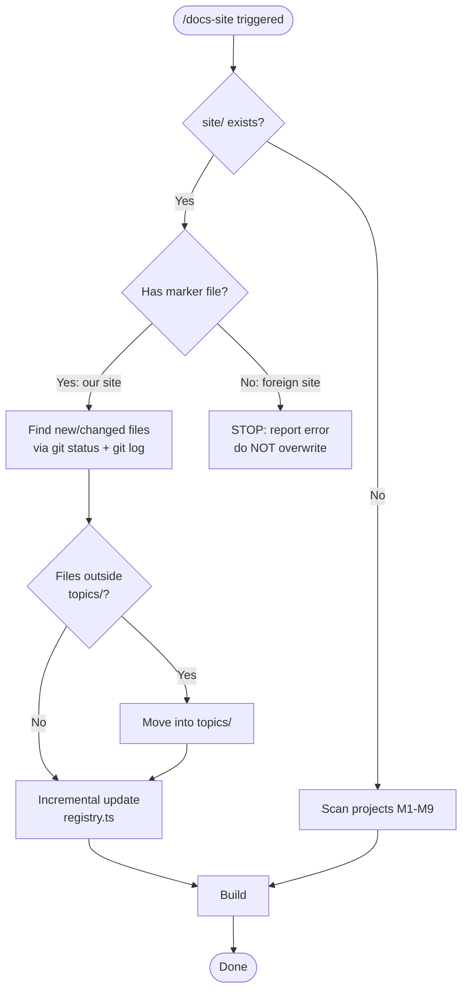
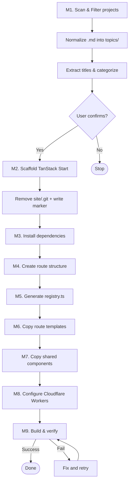

# Docs Site Skill

Scaffold a GitHub-styled TanStack Start documentation site for project analysis documents. Creates a unified hub with per-project sidebar and incremental update support.

## When to Use

Use this skill when the user:
- Asks to "create a docs site", "host analysis docs", "build a documentation site"
- Says `/docs-site` or `/host-docs`
- Wants to publish/surface analysis documents as a browsable web site
- Has analysis `.md` files and wants a web UI for them
- Wants to **update** an existing docs site (add/remove projects, exclude directories)
- Says `/docs-site --exclude ...` or `/docs-site --only ...` on an already-hosted site

## Prerequisites

- bun must be available on the system

## Flow Overview

> Complete trigger, guard, and workflow decision flow.



## ⚠️ FIRST ACTION: Site Existence Guard (MANDATORY — NO EXCEPTIONS)

**This check MUST run as the VERY FIRST STEP every time the skill is triggered, BEFORE any argument parsing or workflow execution. No step may proceed until this guard is resolved.**

Check if the target directory already contains a `site/` subdirectory:

```bash
test -d {target}/site && echo "EXISTS" || echo "NOT_EXISTS"
```

### Decision Flow (STOP AT FIRST MATCH)

1. **`site/` does NOT exist** → Proceed with normal creation workflow (scan, scaffold, etc.)
2. **`site/` exists AND `.docs-site-skill` marker found** → **STOP. Do NOT scaffold. Enter Update Mode only.** (see "Existing Site Update Mode" below)
3. **`site/` exists AND no marker found** → **STOP. Report error and abort. Do NOT overwrite.**

### Error message when site exists but is not ours

```
ERROR: A "site/" directory already exists in the target project.
This site was not created by the docs-site skill and will NOT be overwritten.

If you want to replace it, please remove the existing site/ directory first:
  rm -rf {target}/site

Then re-run /docs-site.
```

### Marker convention

When this skill creates a new site, it MUST write a marker file `site/.docs-site-skill` containing:

```
This site was scaffolded by the docs-site skill.
```

This allows future runs to distinguish our sites from pre-existing ones.

### Key Rule: Never Rebuild Existing Sites

When `site/` already exists with our marker, the skill MUST:
- **ONLY** enter Incremental Update Mode (detect changed files via git, move into topics/, update only affected entries in `registry.ts`, rebuild)
- **NEVER** re-run `bunx create`, re-install deps, or overwrite components/styles
- **NEVER** delete or replace the existing `site/` directory
- **NEVER** re-scan all projects from scratch — only process new/changed `.md` files

---

## Arguments

- Optional: target path (defaults to current working directory)
- Optional: `--name "Site Name"` to override site title
- Optional: `--only project1,project2,...` to include only specific projects
- Optional: `--exclude project1,project2,...` to exclude specific projects

Example invocations:
- `/docs-site` (scan current directory)
- `/docs-site /path/to/code-analysi`
- `/docs-site /path/to/code-analysi --only tokio,k8s,zinx`
- `/docs-site /path/to/code-analysi --exclude resume,stock`
- `/docs-site /path/to/code-analysi --name "Code Analysis Hub"`

### Exclusion Rules

When scanning directories, apply these rules to decide which projects to **include**:

**1. Command-line filtering** (`--only` / `--exclude`):
- If `--only` is provided: **only** include projects whose directory name matches one of the listed names
- If `--exclude` is provided: skip projects whose directory name matches one of the listed names
- If both are provided: `--only` takes precedence (ignore `--exclude`)

**2. Always exclude** (hardcoded skip list):
- `node_modules`, `site`, `.git`, `.claude`, `.vscode`, `.idea`
- Hidden directories (starting with `.`)
- `assets`, `dist`, `build`, `out`, `public`
- Directories with **zero** `.md` files (neither in root nor in `topics/`)

**3. Minimum content threshold**:
- A directory must have **at least 1** `.md` file in `topics/` (after normalization) to be included
- If a directory has `.md` files but they are all `README.md`, it is excluded

**4. Confirmation prompt**:
After scanning and filtering, show the user the final project list with document counts and ask for confirmation before proceeding. Format:

```
Found {count} projects to include:

  ✓ tokio       6 topics
  ✓ k8s         5 topics
  ✓ zinx        13 topics (8 core + 5 deep dives)
  ✗ resume      (excluded: --exclude flag)
  ✗ stock       (excluded: only 0 topic files)

Proceed with these {count} projects? [Y/n]
```

This ensures the user has a chance to review and adjust before the site is generated.

### Existing Site Update Mode (Incremental)

When the user runs `/docs-site` on a target directory that **already has a `site/` directory with the `.docs-site-skill` marker**, enter **update mode** instead of re-scaffolding from scratch.

**Detection**: Check if `{target}/site/.docs-site-skill` exists. If yes → update mode. If `site/` exists but no marker → see "Site Existence Guard" error and abort.

**Core principle: incremental update, not full rebuild.** Only process files that are new or changed since last build. Do NOT re-scan everything.

**What update mode does**:

1. **Discover changed files** using git:
   ```bash
   %% Uncommitted (unstaged + staged)
   git status --porcelain -- '*.md'
   %% Recently committed (last build timestamp from marker file or git log)
   git log --diff-filter=A --name-only --pretty=format: --since="<last-build-time>" -- '*.md'
   ```
   Collect all new/modified `.md` files from both sources.

2. **Normalize locations** — for each changed file found above:
   - If the file is inside a project directory but **NOT** inside `topics/` (e.g. sitting in project root):
     - Move it into `{project}/topics/`
     - Report: `Moved {file} → {project}/topics/`
   - If the file is already inside `topics/` → no move needed

3. **Incrementally update `registry.ts`**:
   - Parse existing `site/src/lib/registry.ts` to get current state
   - For each **new** `.md` file: read its H1 heading, generate slug, add import + entry to the correct project's topic list
   - For each **removed** `.md` file (deleted from disk): remove its import + entry from registry
   - **Do NOT regenerate the entire file** — only add/remove the affected entries
   - Re-number `order` fields for the affected project if needed
   - Ensure slug uniqueness within each project (append suffix on collision)

4. **Rebuild** to verify:
   ```bash
   cd site && bun run build
   ```
5. Report what changed:
   ```
   Updated existing site (incremental).

   Changes:
     + added:    tokio/topics/07-async-scheduler.md
     + added:    zinx/topics/deep-dive-graceful-shutdown.md
     ~ moved:    k8s/05-crd.md → k8s/topics/05-crd.md
     - removed:  stock/topics/01-overview.md

   Registry updated, build succeeded.
   ```

**What update mode does NOT do**:
- Does NOT re-run `bunx create site` (scaffold)
- Does NOT re-install dependencies
- Does NOT overwrite `styles.css`, `Header.tsx`, `Footer.tsx`, or other custom components
- Does NOT reset any user customizations
- Does NOT re-scan all projects from scratch — only processes git-detected changes

**Key rule**: The user may have manually edited styles, components, or config after the initial scaffold. Update mode only touches `registry.ts` — everything else is left alone.

---

## Workflow

> Detailed step-by-step creation workflow (M1-M9).



### M1. Scan Projects & Normalize

0. **Run the Site Existence Guard** (see "⚠️ FIRST ACTION: Site Existence Guard" section above). This is MANDATORY and must happen before anything else. Only proceed with the steps below if the guard returns "site/ does NOT exist".

1. List all subdirectories in the target path. Apply the **Exclusion Rules** from the Arguments section (always-skip dirs, `--only`/`--exclude` flags, minimum content threshold)
2. For each project directory that passes filtering:
   a. Create `mkdir {project}/topics`
   b. Move all `.md` files from project root into `topics/`, **EXCEPT** `README.md` (if it's a generic README)
   c. Report what was moved
   d. Scan `topics/` and extract title from first `# ` heading of each file
   e. Categorize: core (`NN-*.md`), deep-dives (`deep-dive-*.md`), other
   f. Read the first non-heading paragraph from any root-level `*-analysis.md` or first `topics/*.md` as project description
3. Collect all projects into a registry:
   ```
   { name: "tokio", slug: "tokio", description: "...", topics: [...], deepDives: [...] }
   ```
4. **Show confirmation prompt** (per Exclusion Rules #4) with the final project list, included/excluded status, and document counts. Wait for user confirmation before proceeding.
5. After confirmation, report the final project list

### M2. Scaffold TanStack Start

Run inside the target directory:

```bash
bunx --bun @tanstack/cli create site
```

Then:
1. Remove scaffolded `about.tsx`
2. **Remove any `.git` directory created by the scaffold** — the target directory (e.g. `~/ai/code-analysi/`) is already a git repository. A nested `.git` would create a submodule conflict:
   ```bash
   rm -rf site/.git
   ```
3. **Write the marker file** to identify this site as created by the docs-site skill:
   ```bash
   echo "This site was scaffolded by the docs-site skill." > site/.docs-site-skill
   ```

### M3. Install Dependencies

```bash
cd site
bun add react-markdown remark-gfm rehype-highlight highlight.js mermaid
```

### M4. Create Hub File Structure

Create inside `site/src/`:

```
src/
├── components/
│   ├── Header.tsx
│   ├── Footer.tsx
│   ├── ProjectLayout.tsx       # Combines sidebar + main content for project pages
│   ├── MarkdownRenderer.tsx
│   └── MermaidBlock.tsx
├── lib/
│   └── registry.ts             # Auto-generated project registry
└── routes/
    ├── __root.tsx               # Root layout (no sidebar — hub mode)
    ├── index.tsx                # Hub homepage: project card grid
    └── project/
        └── $projectSlug/
            ├── index.tsx        # Project overview (wraps with <ProjectLayout>)
            ├── topics/
            │   └── $slug.tsx    # Topic page (wraps with <ProjectLayout>)
            └── deep-dives/
                └── $slug.tsx    # Deep dive page (wraps with <ProjectLayout>)
```

**Key architecture decision**: Each project page wraps its content with `<ProjectLayout>` which provides the sidebar + main content area. There is NO `project/$projectSlug/__root.tsx` — the layout is handled by a component, not a route layout. This avoids TanStack's nested `__root.tsx` complexity.

### M5. Generate registry.ts

This file is **generated dynamically** and is the core of the hub. For each project and each `.md` file within it, generate:

1. Import statements using Vite `?url` suffix (NOT `?raw` — `?raw` embeds full file content and causes large bundles), with paths relative to `site/src/lib/`. `?url` returns only the asset URL string (~50 bytes); markdown content is loaded at runtime via `useTopicContent` hook.
   **Import names MUST include the project slug as prefix** to avoid collisions across projects:
   ```
   import md_tokio_1 from '../../tokio/topics/01-overview.md?url'
   import md_tokio_2 from '../../tokio/topics/02-architecture.md?url'
   import md_codex_1 from '../../codex/topics/01-intro.md?url'
   import md_codex_2 from '../../codex/topics/02-project-structure.md?url'
   ```
   Naming pattern: `md_{projectSlug}_{sequentialNumber}` — the project slug prefix ensures every import name is globally unique.

2. Extract titles at generation time by reading each `.md` file's H1 heading. Titles are hardcoded in the registry — NOT extracted at runtime.

3. A nested data structure with `url` field (NOT `content`):

**Slug uniqueness rule**: Every topic slug within a project MUST be unique and non-empty. Slug is derived from the filename (without `.md`). If two files in the same project would produce the same slug (e.g. `MongoDB.md` and another `MongoDB.md`, or filenames that normalize to the same string), append a distinguishing suffix based on the title or order number (e.g. `MongoDB-sharding`, `MongoDB-multi-server`). Empty slugs (from files with no meaningful name) must be given a descriptive slug derived from the title. This is critical because:
- `getTopic()` uses `.find()` by slug — duplicate slugs make some pages inaccessible
- React list rendering uses `key={topic.order}` to avoid duplicate key warnings, but slug uniqueness is still required for correct URL routing

```typescript
export interface TopicMeta {
  slug: string
  title: string
  category: 'core' | 'deep-dive' | 'other'
  order: number
  url: string
}

export interface ProjectMeta {
  slug: string
  name: string
  description: string
  topics: TopicMeta[]
  coreTopics: TopicMeta[]
  deepDiveTopics: TopicMeta[]
}

export const projects: ProjectMeta[] = [
  {
    slug: 'tokio',
    name: 'Tokio',
    description: '...',
    topics: [...],
    coreTopics: [...],
    deepDiveTopics: [...]
  },
  // ... more projects
]

export function getProject(slug: string): ProjectMeta | undefined { ... }
export function getTopic(projectSlug: string, topicSlug: string): TopicMeta | undefined { ... }
```

### M6. Copy Route Templates

Copy from `templates/multi/` (see "Route Templates" table below for details):
- `hub-root.tsx` → `site/src/routes/__root.tsx`
- `hub-index.tsx` → `site/src/routes/index.tsx`
- `ProjectLayout.tsx` → `site/src/components/ProjectLayout.tsx`
- `project-index.tsx` → `site/src/routes/project/$projectSlug/index.tsx`
- `project-topic.tsx` → `site/src/routes/project/$projectSlug/topics/$slug.tsx`
- `project-deepdive.tsx` → `site/src/routes/project/$projectSlug/deep-dives/$slug.tsx`

### M7. Copy Shared Components

Copy from `templates/`:
- `styles.css`, `header.tsx`, `footer.tsx`, `markdown-renderer.tsx`, `mermaid-block.tsx`, `theme-toggle.tsx`

Additionally, copy the async content loading hook to `site/src/hooks/`:
- `use-topic-content.ts` → `site/src/hooks/useTopicContent.ts`

### M8. Configure Cloudflare Workers

#### M8a. Install Cloudflare dependencies

```bash
cd site
bun add -d wrangler @cloudflare/vite-plugin
```

#### M8b. Create `wrangler.toml`

Create `site/wrangler.toml`:

```toml
name = "{site-name-hub}"
main = "src/worker.ts"
compatibility_date = "2026-03-28"
compatibility_flags = ["nodejs_compat"]

[assets]
directory = "dist/client"
binding = "ASSETS"
```

#### M8c. Create `src/worker.ts`

Create `site/src/worker.ts`:

```typescript
import server from '../dist/server/server.js'

export default {
  async fetch(request: Request, env: { ASSETS: { fetch: (req: Request) => Promise<Response> } }) {
    const url = new URL(request.url)

    // Static asset requests — serve from ASSETS binding
    if (isStaticAsset(url.pathname)) {
      const assetResponse = await env.ASSETS.fetch(request)
      if (assetResponse.status !== 404) return assetResponse
    }

    // Everything else — SSR
    return server.fetch(request)
  },
} satisfies ExportedHandler<{ ASSETS: Fetcher }>

function isStaticAsset(pathname: string): boolean {
  return /\.(js|css|png|jpg|jpeg|gif|svg|ico|webp|woff|woff2|ttf|eot|json|webmanifest|txt|xml|map|md)$/i.test(pathname)
}
```

#### M8d. Add deploy scripts to `package.json`

Add to `scripts`:

```json
{
  "deploy": "wrangler deploy",
  "cf-dev": "wrangler dev"
}
```

#### M8e. Update `vite.config.ts`

Ensure `server.fs.allow` includes parent directory (for `?url` imports to resolve sibling project directories):

```typescript
server: {
  fs: {
    allow: ['..'],
  },
},
```

### M9. Build & Verify

```bash
cd site && bun run build
```

Report result:

```
Docs site created!

Projects ({count}):
  - tokio: {N} topics, {M} deep dives
  - k8s: {N} topics
  - ...

Start:   cd site && bun run dev
Build:   cd site && bun run build
Deploy:  cd site && bun run deploy  (manual)

Pages:
  - /                            Hub homepage
  - /project/{slug}              Project overview
  - /project/{slug}/topics/{id}  Topic page
  - /project/{slug}/deep-dives/{id}  Deep dive page
```

---

## Template Files

### Shared Components (`~/.claude/skills/docs-site/templates/`)

| File | Purpose |
|---|---|
| `styles.css` | GitHub-style theme (light + dark) |
| `header.tsx` | Sticky header with logo and theme toggle |
| `footer.tsx` | Simple footer |
| `sidebar.tsx` | Left sidebar with grouped navigation links |
| `markdown-renderer.tsx` | react-markdown + remark-gfm + mermaid code block detection |
| `mermaid-block.tsx` | Dynamic mermaid.js renderer |
| `theme-toggle.tsx` | Dark/light theme switcher |
| `use-topic-content.ts` | Hook for fetching markdown content from URL at runtime |
| `worker.ts` | Cloudflare Workers entry point (SSR + static assets) |
| `wrangler.toml` | Cloudflare Workers deployment config |

### Route Templates (`~/.claude/skills/docs-site/templates/multi/`)

| File | Purpose |
|---|---|
| `hub-root.tsx` | Hub root layout (header + hub-main + footer, NO sidebar) |
| `hub-index.tsx` | Hub homepage with project cards |
| `ProjectLayout.tsx` | Component combining sidebar + main content, used by all project pages |
| `project-index.tsx` | Project overview with topic/deep-dive card grids, wrapped in `<ProjectLayout>` |
| `project-topic.tsx` | Topic page with markdown rendering + prev/next, wrapped in `<ProjectLayout>` |
| `project-deepdive.tsx` | Deep dive page with markdown rendering + prev/next, wrapped in `<ProjectLayout>` |
| `registry.ts` | Registry template (placeholder-based, `?url` imports for small bundle) |

## Mermaid Syntax Rules

When writing or validating mermaid code blocks in `.md` files, follow these rules to avoid render failures:

### Comment Syntax
- Use `%%` for comments, **never** `#` — `#` causes Parse error

### Node & Subgraph IDs
- **IDs must be globally unique** — a subgraph ID (e.g. `subgraph DRA[...]`) and a node ID (e.g. `DRA[...]`) cannot share the same name. This creates a "cycle" error.
- **Reserved keywords** are case-insensitive: never use `loop`, `end`, `alt`, `opt`, `par`, `critical`, `break` as node or participant IDs. Use a different name (e.g. `LoopFn` instead of `Loop`).

### Node Label Special Characters
- Wrap labels in **double quotes** when they contain: `@`, `[]`, `:` followed by `/` (e.g. IP CIDR), or `()` immediately after `<br/>`:
  - `@ Symbol` → `ID["@ Symbol"]`
  - `AgentMessage[]` → `ID["AgentMessage"]`
  - `10.244.0.0/16` → `ID["CIDR: 10.244.0.0/16"]`
  - `CronService<br/>(state)` → `ID["CronService<br/>(state)"]`
- The `[]` inside labels is ambiguous with mermaid's node shape syntax — always quote it.
- The `>` from `<br/>` followed by `(` can make the parser treat `(text)` as a rounded-edge node — quote the label.

### sequenceDiagram Rules
- **`alt`/`else`/`end`** syntax only — never use `alt cond1|cond2| target` or `alt 是|否|`:
  ```
  alt condition A
      ...
  else condition B
      ...
  end
  ```
- **`style` directive only works in `graph`/`flowchart`** — never use `style` in `sequenceDiagram`. It causes Parse error.
- **`Note over` only works in `sequenceDiagram`** — never use it in `graph`/`flowchart`.

### HTML Entities
- Never use HTML entities (`&lt;`, `&gt;`, `&amp;`) in mermaid code blocks. They are rendered as literal text, not decoded. Use the actual characters or alternative notation:
  - `HashMap&lt;K,V&gt;` → `HashMap(K,V)` or `HashMap[K,V]`
  - `<-->` should be the literal characters, not `&lt;-->`

### Arrow Syntax
- Bidirectional arrows `<-->` are valid in `graph`/`flowchart` diagrams
- Extra spaces around arrows are fine: `A  <--> B` works

### Nested Subgraphs
- Nested subgraphs are supported in mermaid v10+, but **empty labels** like `subgraph Row1[""]` can cause Parse error. Always give nested subgraphs a meaningful label.

### rehype-highlight Interference
- The `rehype-highlight` plugin wraps code content in `<span class="hljs-*>` elements and adds `hljs` to the class
- The MarkdownRenderer `CodeBlock` component must:
  1. Use regex `className?.match(/language-(\w+)/)?.[1]` (not `replace`) to extract language
  2. Use a recursive `extractText()` function to get plain text from children (not `String(children)` which produces `[object Object]`)

---

## Important Notes

- Always use **bun**, never npm
- **Never initialize `.git` inside `site/`** — the target directory is already a git repo. Remove `site/.git` after scaffolding to avoid submodule conflict.
- **Topic slugs must be unique and non-empty** within each project. Deduplicate by appending suffixes (e.g. `MongoDB-sharding`). Duplicate/empty slugs break `getTopic()` and URL routing.
- **Use `key={topic.order}` (not `key={topic.slug}`)** in all `.map()` lists
- `shellComponent` pattern is required in `__root.tsx` (TanStack Start SSR)
- Mermaid is loaded via dynamic `import('mermaid')` — do not import at top level
- Route file names with `$` like `$slug.tsx` are TanStack Router's dynamic segment syntax
- Deploy is manual: `cd site && bun run deploy`
